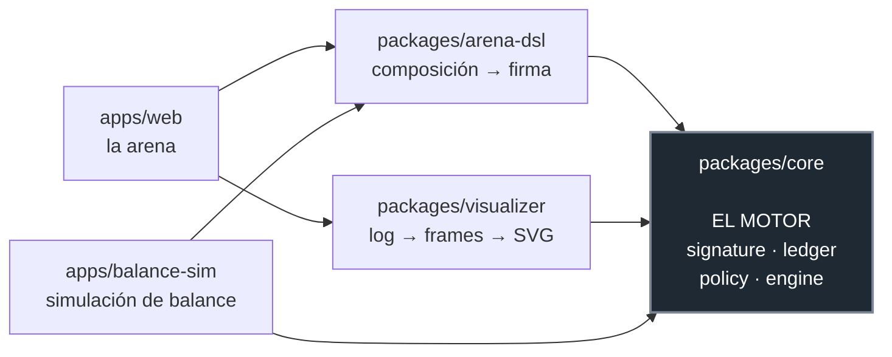
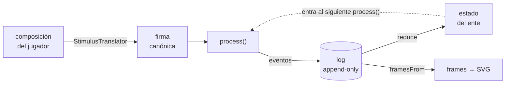

# BeforeHeAdapts

Motor de adaptación agnóstico de dominio, con arquitectura hexagonal y event sourcing.

El motor modela un sistema que **se vuelve resistente a los estímulos que ya vio**. No conoce ataques, jugadores ni pantallas: recibe firmas de estímulo abstractas, las agrupa por similitud y va atenuando su efecto hasta consolidar una adaptación. Qué significa un estímulo lo decide el adaptador que lo enchufa.

El problema conceptual está inspirado en la mecánica de adaptación de un antagonista de shōnen: cada técnica funciona un número acotado de veces, y después deja de funcionar para siempre. La pregunta interesante no es narrativa sino de diseño — **¿cuándo dos estímulos son "el mismo"?** — y es la que el núcleo responde de forma explícita y testeable.

El dominio vitrina es una arena web donde se ataca al ente componiendo ataques con un DSL. El motor no depende de ella: es un adaptador más.

## Alcance

Este repositorio es un **prototipo**: un modelo funcional y una representación visual de la idea que quiero construir. El objetivo final es considerablemente más complejo. Acá valido el núcleo (el contrato, la adaptación y el log de eventos) sobre un dominio acotado, la arena, para comprobar que las reglas se sostienen antes de escalarlas.

## El contrato

Seis reglas. Están escritas como tests ejecutables en `packages/core/src/contract.test.ts`, que es la especificación real del proyecto — el código existe para ponerlas en verde.

1. **Adaptación discreta.** La resistencia solo cambia en saltos, nunca gradualmente.
2. **Complejidad → exposiciones.** `N(c)` es monótona creciente; una firma simple exige una sola exposición.
3. **Contraataque.** Al completar una adaptación se emite `CounterReady`; el dominio lo materializa vía el puerto `CounterSynthesizer`.
4. **Memoria intercambiable.** Permanente, por sesión o con decaimiento de confianza.
5. **Curva decreciente, nunca interruptor.** `eff(k) = asymptote + (base − asymptote) × r^k`, con `asymptote > 0` como piso explícito: un estímulo conocido rinde poco, nunca cero.
6. **Generalización.** Una firma nueva hereda `R₀(s) = max_c [sim(s,c) × transfer(c)]` de lo que el ente ya adaptó.

Las reglas 1 y 5 no se contradicen: operan en capas distintas. `eff(k)` atenúa el estímulo *durante* la adaptación (`k < N(c)`); el salto discreto de resistencia ocurre *al completarla* (`k = N(c)`).

## Arquitectura

Todas las flechas apuntan hacia adentro. El núcleo no importa a nadie: no sabe que existe una arena, ni un visualizador, ni un DSL de ataques.



Esa dirección es lo que hace que el motor sea reutilizable: el mismo núcleo que la arena usa para adaptarse a ataques compuestos es el que la [Fase 5](docs/adr/0005-adaptador-de-autodefensa-del-sitio.md) va a usar para adaptarse a patrones de tráfico hostil, sin tocar una línea.

### El ciclo de un ataque

El estado nunca se muta: se deriva plegando el log. Un replay es literalmente la misma operación con los mismos datos, y por eso produce siempre el mismo resultado.



### Ley de arquitectura

- **`packages/core` es puro y determinista.** Sin I/O, sin `Date.now()`, sin `Math.random()` sin semilla inyectada. El tiempo y la aleatoriedad entran como datos en los eventos.
- **Todo cambio de estado ocurre vía eventos.** El estado es `reduce(log)`; nunca se muta directamente ni se guarda estado derivado como fuente de verdad.
- **El log es append-only y versionado.** Cada evento lleva campo `v`. Los replays viejos deben seguir funcionando siempre, lo que convierte al formato del log en API pública ([ADR 0006](docs/adr/0006-esquema-versionado-eventos.md)).
- **Nada compartido entre salas.** Una sala = un motor + un log, aislados.

Esa pureza no es dogma: es lo que hace que reproducir un log dé siempre el mismo estado, que los tests sean deterministas y que el visualizador pueda reconstruir una partida entera sin haber estado presente.

## Estado

| Fase | Contenido | Estado |
|---|---|---|
| 1 | Núcleo — contrato R1–R6 en verde | completa (`v0.1.0`) |
| 2 | Visualizador — replay del log a SVG | completa (`v0.2.0`) |
| 3a | Arena local single-player — builder, prefabs, persistencia local | completa (`v0.3.0`) |
| 3b | Combate en vivo — gestos por cursor, contraataques, deformación, condición de victoria por actos ([ADR 0011](docs/adr/0011-condicion-de-victoria-actos-y-firmas-viables.md)) | en curso — falta la presión ([ADR 0012](docs/adr/0012-presion-interrupcion-densidad-y-amenaza-basal.md)) |
| Balance | Calibración con suite de simulación masiva y compuerta de regresión | pendiente (fase propia) |
| 4 | Salas online | en pausa |
| 5 | Adaptador de auto-defensa del sitio | pendiente ([ADR 0005](docs/adr/0005-adaptador-de-autodefensa-del-sitio.md)) |

## Cómo correr

Requiere Node ≥ 22 y pnpm.

```bash
pnpm install
pnpm test        # suite completa del workspace
pnpm typecheck
```

Solo el núcleo y su contrato:

```bash
pnpm --filter @beforeheadapts/core test
```

### Jugar la arena

El dominio vitrina, con el motor corriendo entero en el navegador:

```bash
pnpm --filter @beforeheadapts/web dev
```

Se ataca dibujando con el cursor —recta, sostenido, círculo y zigzag— con un elemento armado que se cambia sobre la marcha. Cada golpe es una exposición real: el ente atenúa lo repetido, consolida adaptaciones y arma contraataques con las debilidades que te aprendió. El contador de **firmas viables** de arriba es el instrumento de tensión, y es honesto — mide el multiplicador de daño real de la próxima exposición, no "cuántas quedan sin adaptar".

### Ver el motor con los ojos

El demo del visualizador arma un log sintético con el motor real, lo renderiza a SVG numerados y genera una página autocontenida que los reproduce en secuencia:

```bash
pnpm --filter @beforeheadapts/visualizer demo
```

El resultado queda en `packages/visualizer/renders/demo/index.html`, que abre con doble clic. Se ve el ente sumando un vértice por cada cluster asimilado, el grosor del ataque entrante cayendo con la curva de efectividad, y la onda expansiva del salto de adaptación.

### Simulación de balance

Corre arquetipos de jugador contra el ente y reporta adaptaciones, efectividad y generalización:

```bash
pnpm --filter @beforeheadapts/balance-sim sim
```

## Decisiones de arquitectura

Toda decisión relevante se registra como ADR antes de implementarse. Están en [`docs/adr/`](docs/adr/):

| ADR | Decisión |
|---|---|
| [0001](docs/adr/0001-conciliar-curva-y-salto-discreto.md) | Conciliar la curva decreciente con el salto discreto |
| [0002](docs/adr/0002-identidad-de-cluster-y-formula-de-N.md) | Identidad de cluster por clave canónica exacta y `N(c)` lineal |
| [0003](docs/adr/0003-forma-de-eff-con-piso-explicito.md) | Forma de `eff` con piso explícito |
| [0004](docs/adr/0004-frontera-de-cuantizacion-de-entrada.md) | Frontera de cuantización de entrada |
| [0005](docs/adr/0005-adaptador-de-autodefensa-del-sitio.md) | Adaptador de auto-defensa del sitio |
| [0006](docs/adr/0006-esquema-versionado-eventos.md) | El log exportado es API pública |
| [0007](docs/adr/0007-render-svg-sobre-secuencia-de-frames.md) | Render SVG sobre la secuencia de frames |
| [0008](docs/adr/0008-catalogo-primitivas-dsl-arena.md) | Catálogo de primitivas del DSL de la arena |
| [0009](docs/adr/0009-combate-en-vivo-gestos-ruido-y-contraataque.md) | Combate en vivo: gestos por cursor, ruido ambiental y contraataque |
| [0010](docs/adr/0010-fluidez-y-capa-efimera-del-render.md) | Fluidez y capa efímera del render (replay ≠ grabación) |
| [0011](docs/adr/0011-condicion-de-victoria-actos-y-firmas-viables.md) | Condición de victoria: HP del ente, actos y firmas viables |
| [0012](docs/adr/0012-presion-interrupcion-densidad-y-amenaza-basal.md) | Que la presión exista: interrupción de gestos, densidad y amenaza basal |

Documentación complementaria: [arquitectura y ruta de desarrollo](docs/arquitectura.md), [contrato canónico detallado](docs/contrato.md), [diseño del adaptador web](docs/diseno-adaptador-web.md).

## Testing

Vitest y fast-check. Los invariantes del núcleo van como property tests, no solo como casos de ejemplo: que una propiedad se cumpla para cien entradas generadas dice bastante más que un caso escrito a mano.

Los logs de eventos sirven como fixtures golden — un replay debe producir siempre el mismo estado final, y el mismo SVG byte a byte.

Los números de jugabilidad **se miden, no se estiman**. `apps/web/src/arena/probe.ts` simula corridas completas y deterministas, y sus hallazgos quedan congelados como tests: `enteMaxHp` se propuso a ojo en 500 y era invencible por un factor de tres — el valor real salió de una medición. Cuando un test de esos falla, la respuesta es re-medir, no ajustar el número hasta que pase.
